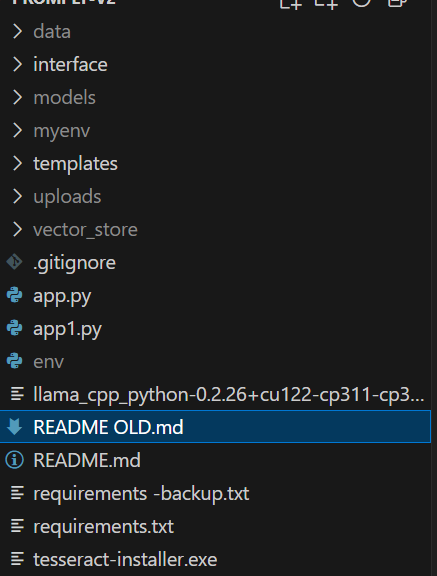

# 🚀 Promply-V2 – Installation Guide  

This guide will help you set up **Promply-V2** on your local machine with GPU (CUDA) support, Python virtual environment, and required dependencies.  

---

## 📦 Prerequisites  

Before installation, make sure you have:  

- ✅ [CUDA Toolkit](https://developer.nvidia.com/cuda-downloads) installed  
- ✅ [Visual Studio Build Tools](https://visualstudio.microsoft.com/visual-cpp-build-tools/) installed  
- ✅ [Python 3.11](https://www.python.org/downloads/release/python-3110/) installed  
- ✅ [Google Drive](https://drive.google.com/drive/folders/1ICX0rQ5p6aZtJb6kw5YfYMc2m7atXvdo?usp=sharing) Models
- ✅ [Google Drive 2](https://drive.google.com/drive/folders/1pvCsdTdeqOpFGVWut3DPHhPdMHY3fF-P?usp=sharing) Models 2

---

## ⚙️ Setup Instructions  

### 1️⃣ Create Virtual Environment  
```
py -3.11 -m venv myenv
myenv\Scripts\activate
```

### 2️⃣ Install PyTorch with CUDA Support
```
pip install --upgrade --force-reinstall torch torchvision torchaudio --index-url https://download.pytorch.org/whl/cu121

```

### 3️⃣ Install llama.cpp Python Binding

```
pip install --force-reinstall .\llama_cpp_python-0.2.26+cu122-cp311-cp311-win_amd64.whl
```

### 4️⃣ Install Project Dependencies

```
pip install -r requirements.txt
```

If you need to reset your environment:

```
deactivate
Remove-Item -Path "P:\Promply-V2\myenv" -Recurse -Force
pip install -r requirements.txt
```

### 5️⃣ Create Required Folders
```
mkdir uploads
mkdir models
```

---


## 🖼️ OCR Setup (Tesseract)
### 1️⃣ Install Tesseract

Download & install from UB Mannheim Tesseract [Download](https://github.com/UB-Mannheim/tesseract/wiki).

### 2️⃣ Add Tesseract to PATH
Add this line at the end:

```
setx PATH "%PATH%;C:\Program Files\Tesseract-OCR"
```

### 3️⃣ Reactivate Environment
```
deactivate
.\myenv\Scripts\activate
```
### 4️⃣ Verify Installation

```
tesseract --version
```

---


## 🔑 Environment Variables
Create a .env file in the project root:

```
# Google Custom Search
GOOGLE_API_KEY=
GOOGLE_CX=

# Gemini
GEMINI_API_KEY=

# OpenAI 
OPENAI_API_KEY=
```

## ▶️ Run the Project

After setup, start the application with:

```
python app.py

```

## Images

Contents of the code

```
PROMPLY-V2
├── data/
├── Images/
├── interface/
├── models/
├── myenv/
├── Test Interface/
│   └── index.html
├── uploads/
│   └── images/
├── vector_store/
├── .env.example
├── .gitignore
├── app.py
├── env
├── package-lock.json
├── README OLD.md
├── README.md
├── requirements-backup.txt
├── requirements.txt
├── tesseract-installer.exe
└── TODO.md

```



Landing Page


Uploading UI


Progress Bar/UI


---

## ✅ Done!
You are now ready to run Promply-V2 🎉