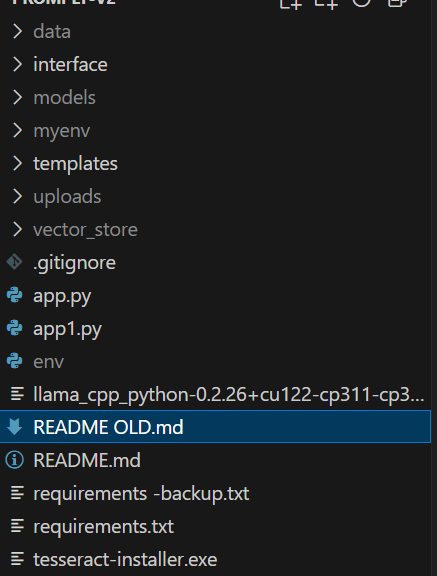

# 🚀 Promply-V2 — Installation & Setup Guide

Promply-V2 is an AI-powered document search and OCR application, supporting NVIDIA GPU acceleration, vector search, and the latest LLM APIs.

---

## ✅ Prerequisites

Before installing, ensure the following are installed on your system:

| Requirement | Purpose |
|------------|---------|
| **Python 3.11** | Required runtime |
| **NVIDIA GPU + CUDA Toolkit (12.X recommended)** | GPU acceleration |
| **Visual Studio Build Tools** | For building Python dependencies |
| **Tesseract OCR** | Extract text from PDFs/images |

Optional model downloads:   
📁 [Models (Google Drive Link 1)](https://drive.google.com/drive/folders/1HOnDhHKFnIaD96kj-8zbLoGCrBK4Pklf?usp=drive_link)

---

## ⚙️ Installation Steps

### 1️⃣ Clone the Repository

```bash
git clone https://github.com/shawnrodrigues/Promply-V2.git
cd Promply-V2
```

### 2️⃣ Create & Activate Virtual Environment

```bash
py -3.11 -m venv myenv
myenv\Scripts\activate
```

### 3️⃣ Install PyTorch with CUDA Support

```bash
pip install --upgrade pip setuptools wheel
pip install torch torchvision torchaudio --index-url https://download.pytorch.org/whl/cu121
```

If GPU installation fails, install CPU-only:

```bash
pip install torch torchvision torchaudio
```

### 4️⃣ Install Project Dependencies

```bash
pip install -r requirements.txt
```

---

## 📂 Folder Creation (Required)

Create folders if they don’t exist:

```bash
mkdir uploads models vector_store
mkdir uploads\images
```

---

## 🖼️ Tesseract OCR Setup

### Install Tesseract
Download from:  
🔗 https://github.com/UB-Mannheim/tesseract/wiki

### Add to PATH (Windows PowerShell)

```bash
setx PATH "%PATH%;C:\Program Files\Tesseract-OCR"
```

### Verify Installation

```bash
tesseract --version
```

---

## 🔑 Environment Variables

Create a file named `.env` in the project root:

```ini
# Google Search
GOOGLE_API_KEY=
GOOGLE_CX=

# Gemini API
GEMINI_API_KEY=

# OpenAI
OPENAI_API_KEY=
```

---

## ▶️ Run Promply-V2

```bash
python app.py
```

Then open:

```
http://localhost:5000
```

---

## 📸 UI Preview

### Project Structure
```
PROMPLY-V2
├── data/
├── Images/
├── interface/
├── models/
├── uploads/
│   └── images/
├── vector_store/
├── app.py
├── requirements.txt
└── README.md
```



Landing Page


Uploading UI


Progress Bar UI


Chat-Box UI


---

## 🔁 Environment Reset (If Required)

```bash
deactivate
Remove-Item -Recurse -Force myenv
py -3.11 -m venv myenv
myenv\Scripts\activate
pip install -r requirements.txt
```

---

## ✅ You’re Ready!

You now have Promply-V2 successfully running! 🚀  
Have fun exploring the power of AI search & OCR! 😄
